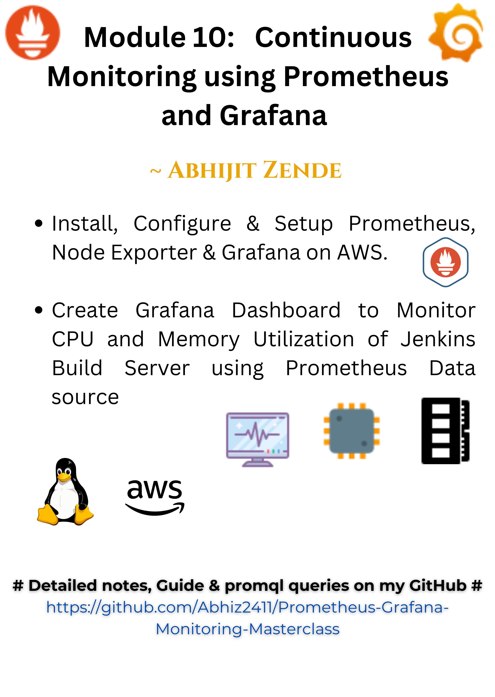

# 🚀 DevOps Sentinel: Prometheus & Grafana Monitoring Playground 🔭



### 📦 Project Modules

#### L0 & L1: Monitoring Infrastructure Setup
- 🔍 Prometheus Installation & Configuration
- 📊 Node Exporter Integration
- 🖥️ Grafana Dashboard Creation
- 📈 Jenkins Server Monitoring

### 🛠️ Tech Stack
- Prometheus
- Node Exporter
- Grafana
- Jenkins

### 🚀 Quick Setup

#### Prerequisites
- Linux/Ubuntu Server
- Docker (Recommended)
- Basic DevOps Knowledge


### 📋 Installation Steps

1. 🔧 Prometheus Installation
```bash
# Add Prometheus Installation Commands
wget https://github.com/prometheus/prometheus/releases/download/v2.30.3/prometheus-2.30.3.linux-amd64.tar.gz
tar xvfz prometheus-*.tar.gz
cd prometheus-*
```

2. 🌐 Node Exporter Configuration
```bash
wget https://github.com/prometheus/node_exporter/releases/download/v1.2.2/node_exporter-1.2.2.linux-amd64.tar.gz
tar xvfz node_exporter-*.tar.gz
```

3. 🖼️ Grafana Setup
```bash
sudo apt-get install -y software-properties-common
sudo add-apt-repository "deb https://packages.grafana.com/oss/deb stable main"
wget -q -O - https://packages.grafana.com/gpg.key | sudo apt-key add -
```

### 📊 Prometheus Configuration (prometheus.yml)
```yaml
global:
  scrape_interval: 15s

scrape_configs:
  - job_name: 'jenkins_server'
    static_configs:
      - targets: ['jenkins-server-ip:9100']
```

### 🔥 Common Grafana PromQL Queries

1. CPU Utilization
```promql
100 - (avg by (instance) (irate(node_cpu_seconds_total{mode="idle"}[5m])) * 100)
```

2. Memory Usage
```promql
(node_memory_MemTotal_bytes - node_memory_MemAvailable_bytes) / node_memory_MemTotal_bytes * 100
```

3. Disk Space
```promql
100 - (node_filesystem_avail_bytes{mountpoint="/"} / node_filesystem_size_bytes{mountpoint="/"} * 100)
```

### 🎯 Dashboard Configuration Tips
- Use template variables
- Set appropriate refresh rates
- Configure alerting thresholds
- Use color-coded panels

### 🔗 Useful Resources
- [Prometheus Official Docs](https://prometheus.io/docs/introduction/overview/)
- [Grafana Tutorials](https://grafana.com/tutorials/)
- [Node Exporter Metrics](https://prometheus.io/docs/guides/node-exporter/)

### 🤝 Contribution Guidelines
1. Fork the repository
2. Create your feature branch
3. Commit your changes
4. Push to the branch
5. Create a Pull Request

### 📜 License
MIT License 🆓

### 💡 Pro Tips
- Always secure your monitoring infrastructure
- Regularly update exporters and monitoring tools
- Monitor your monitoring system! 🕵️‍♂️

### Connect with me
- Portfolio website: https://abhijit-zende.vercel.app/
- Blogpost: https://abhijitzende.hashnode.dev/

### 🚨 Disclaimer
Configuration might vary based on your specific infrastructure. Always test in a staging environment first! 🧪
